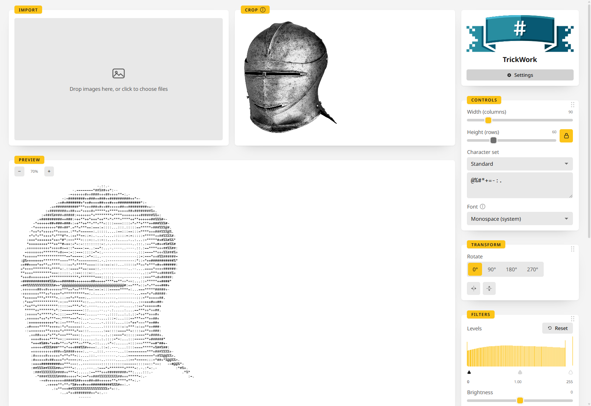

<p align="center">
  <picture>
    <source media="(prefers-color-scheme: dark)" srcset="https://raw.githubusercontent.com/junkerderprovinz/trickwork/main/.github/assets/trickwork-banner-dark.png">
    
  </picture>
</p>

<p align="center">
  <a href="https://github.com/junkerderprovinz/trickwork/actions/workflows/ci.yml"></a>&nbsp;
  <a href="https://github.com/junkerderprovinz/trickwork/actions/workflows/container.yml"></a>&nbsp;
  <a href="https://hub.docker.com/r/junkerderprovinz/trickwork"></a>&nbsp;
  <a href="https://github.com/junkerderprovinz/trickwork/releases"></a>&nbsp;
  <a href="https://github.com/junkerderprovinz/trickwork/pkgs/container/trickwork"></a>&nbsp;
  <a href="https://wails.io"></a>&nbsp;
  <a href="https://unraid.net"></a>&nbsp;
  <a href="LICENSE"></a>
</p>

<br>

<p align="center">
TrickWork turns your images into <b>proportional-font-aware ASCII art</b>, with a <b>live interactive
preview</b> and <b>TXT / XHTML / RTF / PNG export</b>. It's the feature set of the abandoned
<a href="https://sourceforge.net/projects/ascgen2/">ASCGen2</a>, rebuilt: characters are picked by how much
visual "ink" they cover at your chosen font, not just by brightness, so proportional (non-monospace) fonts
render correctly instead of looking stretched or squashed.<br>
<br>
Ships two ways from one shared TypeScript/Canvas core, so the desktop app and the self-hosted container are
always pixel-for-pixel the same tool: a <b>desktop app</b> for Windows, macOS and Linux (via Wails) and a
<b>self-hosted Docker container</b> (with an Unraid Community Applications template). Stateless: no
database, no accounts, nothing to configure beyond the port.
</p>

<br>

<!-- download-buttons: written by scripts/gen_download_buttons.py -->
<p align="center">
  <a href="https://github.com/junkerderprovinz/trickwork/releases/latest/download/trickwork-windows-amd64-installer.exe"></a><a href="https://github.com/junkerderprovinz/trickwork/releases/latest/download/trickwork-windows-arm64-installer.exe"></a><a href="https://github.com/junkerderprovinz/trickwork/releases/latest/download/trickwork-windows-amd64-portable.exe"></a>
  &nbsp;
  <a href="https://github.com/junkerderprovinz/trickwork/releases/latest/download/trickwork-macos-universal.dmg"></a>
  &nbsp;
  <a href="https://github.com/junkerderprovinz/trickwork/releases/latest/download/trickwork-linux-amd64"></a>
</p>
<p align="center">
  <a href="https://github.com/junkerderprovinz/trickwork/pkgs/container/trickwork"></a>
  &nbsp;
  <a href="https://github.com/junkerderprovinz/trickwork/releases/latest"></a>
  &nbsp;
  <a href="https://junkerderprovinz.github.io/trickwork/"></a>
  <br><sub>Always downloads the latest build</sub>
</p>
<!-- /download-buttons -->

<br>

<p align="center">
A one-knight job: I build it, keep it running, work through the issues and add what people ask for, until nothing is missing. It is free, with no accounts, no telemetry, no ads and no paid tier. No asterisk anywhere. Nothing readable ever leaves your own walls. Forged on evenings and weekends, with heart and stubbornness.
</p>

<p align="center">
If it has earned a place on your server or computer, toss a coin to your knight: it helps cover the costs and keeps the project alive. It also makes this knight's heart beat a little faster. Three ways below, whichever suits you.
</p>

<br>

<!-- give-buttons: written by scripts/gen_download_buttons.py -->
<p align="center">
  <a href="https://buymeacoffee.com/junkerderprovinz"></a>
  &nbsp;
  <a href="https://www.paypal.com/donate/?hosted_button_id=76FVV52TKXTUS"></a>
  &nbsp;
  <a href="https://junkerderprovinz.github.io/junkerderprovinz/"></a>
</p>
<!-- /give-buttons -->


<br>

## Table of Contents

1. [What is this?](#1-what-is-this)
2. [Screenshots](#2-screenshots)
3. [Features](#3-features)
4. [Getting started](#4-getting-started)
5. [Documentation](#5-documentation)
6. [Credits](#6-credits)
7. [License](#7-license)
8. [How AI is used here](#8-how-ai-is-used-here)
9. [Support this project](#9-support-this-project)

<br>

## 1. What is this?

TrickWork is a free, open-source ASCII art generator. It converts an image into ASCII (character-based) art,
as a desktop app for Windows, macOS and Linux or as a self-hosted container. Drop an image, tune the sliders,
watch the preview update live, export in whichever format you need.

The name is a heraldic term: **"tricking"** is the historical practice of sketching a coat of arms in outline
and marking its colours with letter abbreviations instead of paint, a near-literal description of what this
tool does to a picture.

### How it compares

Every actively-maintained image-to-ASCII tool (`chafa`, `ascii-image-converter`, `jp2a`, `img2txt`/libcaca) is
CLI-only, monospace-only, and has no live preview. ASCGen2 (the direct inspiration for this project, C#/.NET,
GPLv2, last updated 2015) had all three of those (proportional-width awareness, a real-time GUI, multi-format
export), and nothing since has replaced it. TrickWork is that combination, rebuilt from scratch.

<br>

## 2. Screenshots

<p align="center">
  
  <br><em>Dark mode: every slider updates the live preview instantly; export the active image or the whole queue at once.</em>
</p>

<br>

<p align="center">
  
  <br><em>Light mode, the same working layout. Theme, shape and accent are all yours to pick in Settings.</em>
</p>

<br>

## 3. Features

- **Proportional-font-aware character mapping**: measures each candidate character's actual rendered ink
  coverage at your chosen font and picks the closest match, so proportional (non-monospace) fonts map
  correctly instead of assuming every character is the same width.
- **Real-time live preview**: every slider (width, brightness, contrast), the character-set choice and the
  font all update the preview immediately, no re-render delay.
- **Image adjustments**: crop, rotate and flip, levels, brightness and contrast, invert, dithering, colour
  output and sharpening, all with undo and redo.
- **Batch queue**: drop multiple images at once; each converts and can be exported independently, and one
  bad file never blocks the rest.
- **Four export formats**: plain **TXT**, a styled **XHTML** document, **RTF** (always rendered in a fixed
  monospace font; most RTF readers can't reliably honor an arbitrary proportional font, so this is called
  out in the UI rather than silently looking different from the preview), and a rendered **PNG** image, which
  is the one format that can faithfully reproduce a proportional-font look since it draws the characters onto
  a canvas itself instead of relying on the viewer's own font rendering.
- **Ten built-in character sets**: nine of them are ASCII Gen 2's own original ramps, fetched and verified
  byte-for-byte against its real 2011 source, weighting mechanic included: repeat a character in the ramp and
  it claims proportionally more of the brightness range, exactly like the original. Plus a bonus 70-character
  `detailed` ramp for extra tonal range, or type your own custom character string, repeats and all.
- **Four font choices, no bundled font files**: two monospace, two proportional, all resolving to fonts
  already installed on your system.
- **Automatic downscaling** for very large source images, so the live-preview loop stays fast. The UI marks
  a queue item as downscaled when this happens.

<br>

## 4. Getting started

- **Desktop app:** pick your system from the buttons at the top. The portable Windows file and the Linux
  binary run without installing anything. Windows may warn about an unsigned download the first time; click
  **More info**, then **Run anyway**.
- **Docker:**

  ```bash
  docker run -d --name trickwork --restart unless-stopped -p 3210:3210 ghcr.io/junkerderprovinz/trickwork:latest
  ```

  Then open `http://localhost:3210/`. No environment variables, no volumes.
- **Unraid:** open **Apps**, search for **TrickWork** and install it from Community Applications.

Every way in detail, including the requirements and the Unraid template by hand, is on the
[installing page](https://junkerderprovinz.github.io/trickwork/installing/).

<br>

## 5. Documentation

The [documentation site](https://junkerderprovinz.github.io/trickwork/) has the full guide:

- [Start here](https://junkerderprovinz.github.io/trickwork/): what TrickWork does and what sets it apart
- [Installing](https://junkerderprovinz.github.io/trickwork/installing/): desktop, Docker and Unraid
- [How it works and building it](https://junkerderprovinz.github.io/trickwork/development/): the engine and the development commands

<br>

## 6. Credits

Directly inspired by [ASCGen2](https://sourceforge.net/projects/ascgen2/) (SourceForge, C#/.NET, GPLv2,
abandoned since 2015): same core differentiator, fresh implementation. UI design language is
[GlimStone](https://github.com/junkerderprovinz/glimstone), shared across every app in this house.

The helmet in the screenshots is a
[close helmet by Hans Maystetter](https://commons.wikimedia.org/wiki/File:Close_Helmet_MET_DP-12880-038.jpg)
from The Metropolitan Museum of Art, which released the photo under CC0.

<br>

## 7. License

**Copyright (C) 2026 Junker der Provinz.**

TrickWork is free software under the **GNU Affero General Public License v3.0** (AGPL-3.0); see
[LICENSE](LICENSE). You may run, study, share and modify it. If you distribute it, or run a modified version
as a network service, you must release your source under the same AGPL-3.0 terms and keep the existing
copyright and attribution notices intact.

**Name and branding are not licensed.** The AGPL covers the source code only. "TrickWork", its logo and its
branding remain reserved: a fork or derivative must use its own distinct name and branding, and may not
present itself as TrickWork.

<br>

## 8. How AI is used here

One knight builds this, and AI is one of the tools I work with, the same way I work with an editor or a compiler. It helps me write code and documentation and it checks my work, and that saves me a good many evenings. It does not make the decisions, though. I read and understand everything before it ships, and if something here breaks, that is on me and not on the tool.

You do not have to take my word for it. The code is open and every release note is written by hand. The issue tracker shows how problems actually get handled, including the ones I got wrong the first time. If you find something that is not right, open an issue and I will look at it.

<br>

## 9. Support this project

Bugs, ideas or feature requests? Please [open a GitHub issue](https://github.com/junkerderprovinz/trickwork/issues).

A one-knight job: I build it, keep it running, work through the issues and add what people ask for, until nothing is missing. It is free, with no accounts, no telemetry, no ads and no paid tier. No asterisk anywhere. Nothing readable ever leaves your own walls. Forged on evenings and weekends, with heart and stubbornness.

If it has earned a place on your server or computer, toss a coin to your knight: it helps cover the costs and keeps the project alive. It also makes this knight's heart beat a little faster. Three ways below, whichever suits you.

<!-- give-buttons: written by scripts/gen_download_buttons.py -->
<p align="center">
  <a href="https://buymeacoffee.com/junkerderprovinz"></a>
  &nbsp;
  <a href="https://www.paypal.com/donate/?hosted_button_id=76FVV52TKXTUS"></a>
  &nbsp;
  <a href="https://junkerderprovinz.github.io/junkerderprovinz/"></a>
</p>
<!-- /give-buttons -->
