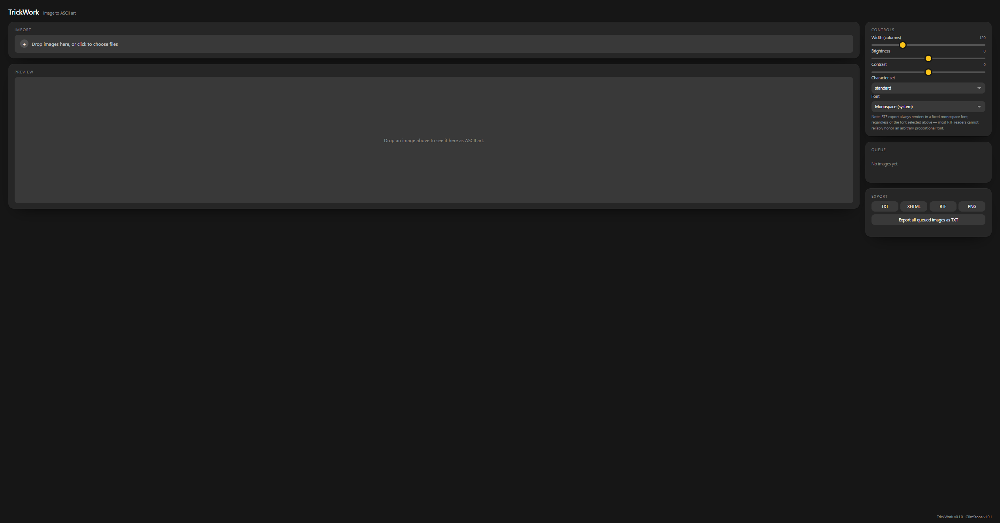
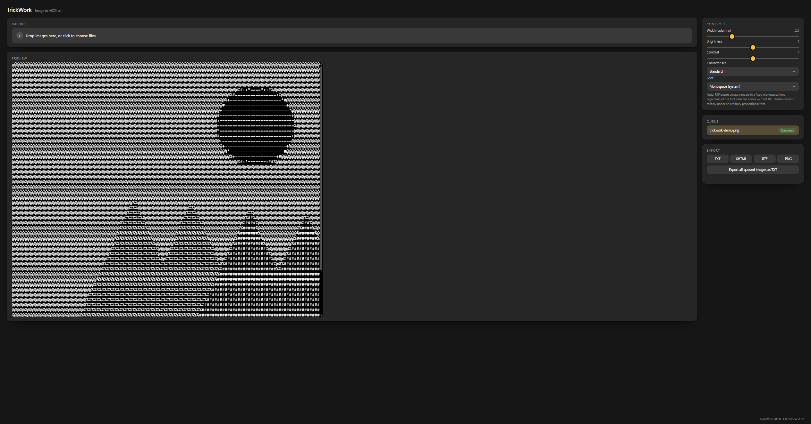

<p align="center">
  <picture>
    <source media="(prefers-color-scheme: dark)" srcset="https://raw.githubusercontent.com/junkerderprovinz/trickwork/main/.github/assets/trickwork-banner-dark.png">
    
  </picture>
</p>

<p align="center">
  <a href="https://github.com/junkerderprovinz/trickwork/actions/workflows/ci.yml"></a>&nbsp;
  <a href="https://github.com/junkerderprovinz/trickwork/actions/workflows/container.yml"></a>&nbsp;
  <a href="https://github.com/junkerderprovinz/trickwork/pkgs/container/trickwork"></a>&nbsp;
  <a href="https://wails.io"></a>&nbsp;
  <a href="https://unraid.net"></a>&nbsp;
  <a href="LICENSE"></a>
</p>

<br>

<p align="center">
TrickWork turns your images into <b>proportional-font-aware ASCII art</b> — with a <b>live interactive
preview</b> and <b>TXT / XHTML / RTF / PNG export</b>. It's the feature set of the abandoned
<a href="https://sourceforge.net/projects/ascgen2/">ASCGen2</a>, rebuilt: characters are picked by how much
visual "ink" they cover at your chosen font, not just by brightness, so proportional (non-monospace) fonts
render correctly instead of looking stretched or squashed.<br>
<br>
Ships two ways from one shared TypeScript/Canvas core, so the desktop app and the self-hosted container are
always pixel-for-pixel the same tool: a <b>portable desktop app</b> (Windows/Linux/macOS, via Wails, no
installer) and a <b>self-hosted Docker container</b> (with an Unraid Community Applications template).
Stateless — no database, no accounts, nothing to configure beyond the port.
</p>

<br>

<p align="center">
Maintained solo, in whatever spare time there is. Bugs, ideas or feature requests? Please <a href="https://github.com/junkerderprovinz/trickwork/issues">open a GitHub issue</a>. If it's useful to you, a coffee is always welcome.
</p>

<br>

<p align="center">
  <a href="https://buymeacoffee.com/junkerderprovinz">
    
  </a>
</p>

<br>

## Table of Contents

1. [What is this?](#1-what-is-this)
2. [Screenshots](#2-screenshots)
3. [Features](#3-features)
4. [How it works](#4-how-it-works)
5. [Requirements](#5-requirements)
6. [Install on Unraid](#6-install-on-unraid)
7. [Plain Docker (no Unraid)](#7-plain-docker-no-unraid)
8. [Desktop app](#8-desktop-app)
9. [Development](#9-development)
10. [Credits](#10-credits)
11. [License](#11-license)
12. [Support this project](#12-support-this-project)

<br>

## 1. What is this?

TrickWork is a self-hosted, single-purpose tool that converts an image into ASCII (character-based) art. Drop
an image, tune the sliders, watch the preview update live, export in whichever format you need.

The name is a heraldic term: **"tricking"** is the historical practice of sketching a coat of arms in outline
and marking its colours with letter abbreviations instead of paint — a near-literal description of what this
tool does to a picture.

### How it compares

Every actively-maintained image-to-ASCII tool (`chafa`, `ascii-image-converter`, `jp2a`, `img2txt`/libcaca) is
CLI-only, monospace-only, and has no live preview. ASCGen2 (the direct inspiration for this project, C#/.NET,
GPLv2, last updated 2015) had all three of those — proportional-width awareness, a real-time GUI, multi-format
export — and nothing since has replaced it. TrickWork is that combination, rebuilt from scratch.

<br>

## 2. Screenshots

<p align="center">
  
  <br><em>Drop an image or click to browse — the whole layout is one screen, no menus to dig through.</em>
</p>

<br>

<p align="center">
  
  <br><em>Live preview updates as you move any slider; export the active image or the whole queue at once.</em>
</p>

<br>

## 3. Features

- **Proportional-font-aware character mapping** — measures each candidate character's actual rendered ink
  coverage at your chosen font and picks the closest match, so proportional (non-monospace) fonts map
  correctly instead of assuming every character is the same width.
- **Real-time live preview** — every slider (width, brightness, contrast), the character-set choice and the
  font all update the preview immediately, no re-render delay.
- **Batch queue** — drop multiple images at once; each converts and can be exported independently, and one
  bad file never blocks the rest.
- **Four export formats** — plain **TXT**, a styled **XHTML** document, **RTF** (always rendered in a fixed
  monospace font — most RTF readers can't reliably honor an arbitrary proportional font, so this is called
  out in the UI rather than silently looking different from the preview), and a rendered **PNG** image, which
  is the one format that can faithfully reproduce a proportional-font look since it draws the characters onto
  a canvas itself instead of relying on the viewer's own font rendering.
- **Four built-in character sets** — a short `standard` ramp, a long `detailed` ramp, Unicode `blocks`, or
  your own custom character string.
- **Four font choices, no bundled font files** — two monospace, two proportional, all resolving to fonts
  already installed on your system.
- **Automatic downscaling** for very large source images, so the live-preview loop stays fast — the UI marks
  a queue item as downscaled when this happens.

<br>

## 4. How it works

A single TypeScript/Canvas conversion engine (`core/`) is the *only* place the algorithm lives — built once,
embedded into both packages, so the desktop app and the container can never drift apart or disagree on what
a given image should look like. There's no server-side logic to speak of: every operation is "load an image,
adjust, export," and nothing is remembered between sessions.

<br>

## 5. Requirements

- **Container:** any amd64 or arm64 Docker host. No database, no volumes — the app is entirely stateless.
- **Desktop:** Windows 10/11, Linux (needs `libwebkit2gtk-4.1-0` at runtime), or macOS.

<br>

## 6. Install on Unraid

Pull the template into Unraid via the console / SSH:

```bash
mkdir -p /boot/config/plugins/dockerMan/templates-user && \
curl -fsSL -o /boot/config/plugins/dockerMan/templates-user/my-trickwork.xml \
  https://raw.githubusercontent.com/junkerderprovinz/unraid-apps/main/trickwork/trickwork.xml
```

Then **Docker → Add Container → trickwork** under *User templates*, pick a port, hit **Apply**, open the
WebUI.

The template filename **must** keep the `my-` prefix (`my-trickwork.xml`) so Unraid treats it as a user
template.

<br>

## 7. Plain Docker (no Unraid)

```bash
docker run -d \
  --name trickwork \
  --restart unless-stopped \
  -p 3210:3210 \
  ghcr.io/junkerderprovinz/trickwork:latest
```

Open `http://localhost:3210/`. No environment variables, no volumes — that's the whole configuration surface.

<br>

## 8. Desktop app

A portable Wails wrapper around the exact same engine and UI the container serves — no installer, a single
file. Windows, Linux and macOS builds are produced by CI from a version tag; see
[Releases](https://github.com/junkerderprovinz/trickwork/releases) once one exists. To build it yourself
right now, see [Development](#9-development) below.

<br>

## 9. Development

```bash
npm install
npm run build              # builds core/ then ui/
npm run test --workspace core
npm run typecheck
npm run e2e --workspace ui  # Playwright, needs `npx playwright install --with-deps chromium` first
```

**Container image:**

```bash
docker build -t trickwork:dev -f container/Dockerfile .
docker run -p 3210:3210 trickwork:dev
```

**Desktop app:**

```bash
npm run build --workspace core
rm -rf webembed/dist && cp -r ui/dist webembed/dist
cd desktop && go mod tidy && wails build
```

Output: `desktop/build/bin/TrickWork[.exe]`.

<br>

## 10. Credits

Directly inspired by [ASCGen2](https://sourceforge.net/projects/ascgen2/) (SourceForge, C#/.NET, GPLv2,
abandoned since 2015) — same core differentiator, fresh implementation. UI design language is
[GlimStone](https://github.com/junkerderprovinz/glimstone), shared across every app in this house.

<br>

## 11. License

**Copyright (C) 2026 Junker der Provinz.**

TrickWork is free software under the **GNU Affero General Public License v3.0** (AGPL-3.0); see
[LICENSE](LICENSE). You may run, study, share and modify it. If you distribute it, or run a modified version
as a network service, you must release your source under the same AGPL-3.0 terms and keep the existing
copyright and attribution notices intact.

**Name and branding are not licensed.** The AGPL covers the source code only. "TrickWork", its logo and its
branding remain reserved: a fork or derivative must use its own distinct name and branding, and may not
present itself as TrickWork.

<br>

## 12. Support this project

Bugs, ideas or feature requests? Please [open a GitHub issue](https://github.com/junkerderprovinz/trickwork/issues).

This is a one-person project. I put a lot of time and effort into building and maintaining it, in whatever
free time I have. If it's helped you, I'd genuinely appreciate the support: you're welcome to buy me a
coffee.

<p align="center">
  <a href="https://buymeacoffee.com/junkerderprovinz">
    
  </a>
</p>
