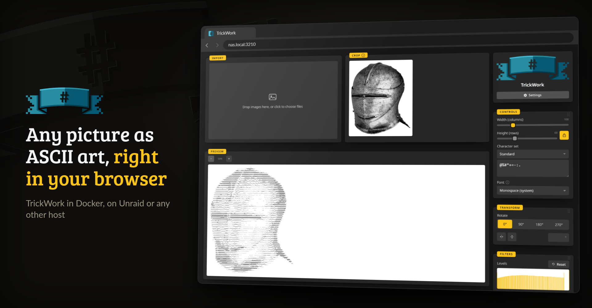
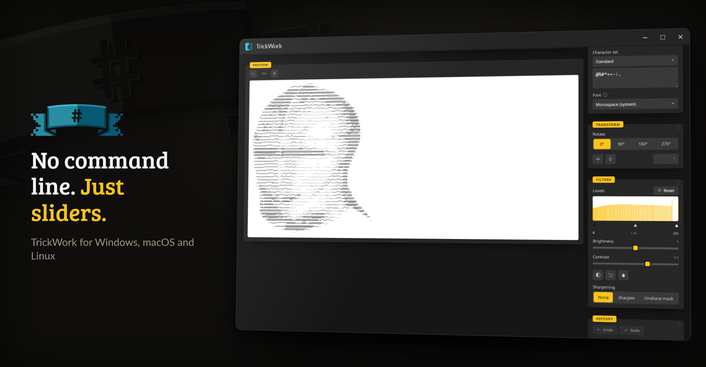
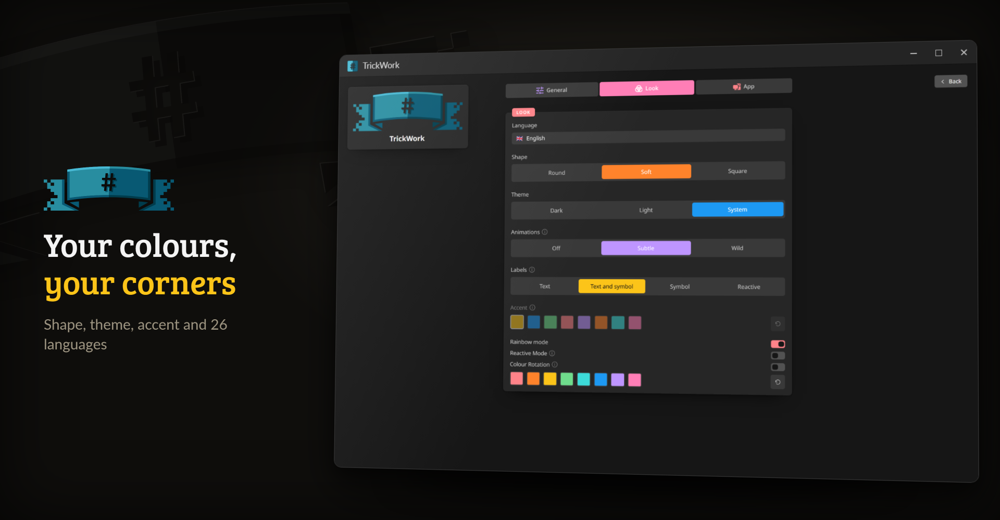

<p align="center">
  <picture>
    <source media="(prefers-color-scheme: dark)" srcset="https://raw.githubusercontent.com/junkerderprovinz/trickwork/main/.github/assets/trickwork-banner-dark.png">
    
  </picture>
</p>

<p align="center">
  <a href="https://github.com/junkerderprovinz/trickwork/actions/workflows/ci.yml"></a>&nbsp;
  <a href="https://github.com/junkerderprovinz/trickwork/actions/workflows/container.yml"></a>&nbsp;
  <a href="https://hub.docker.com/r/junkerderprovinz/trickwork"></a>&nbsp;
  <a href="https://github.com/junkerderprovinz/trickwork/releases"></a>&nbsp;
  <a href="https://github.com/junkerderprovinz/trickwork/pkgs/container/trickwork"></a>&nbsp;
  <a href="https://wails.io"></a>&nbsp;
  <a href="https://unraid.net"></a>&nbsp;
  <a href="LICENSE"></a>
</p>

<br>

<p align="center">
TrickWork turns your images into <b>proportional-font-aware ASCII art</b>, with a <b>live interactive
preview</b> and <b>TXT / XHTML / RTF / PNG export</b>. It's the feature set of the abandoned
<a href="https://sourceforge.net/projects/ascgen2/">ASCGen2</a>, rebuilt: characters are picked by how much
visual "ink" they cover at your chosen font, not just by brightness, so proportional (non-monospace) fonts
render correctly instead of looking stretched or squashed.<br>
<br>
Ships two ways from one shared TypeScript/Canvas core, so the desktop app and the self-hosted container are
always pixel-for-pixel the same tool: a <b>desktop app</b> for Windows, macOS and Linux (via Wails) and a
<b>self-hosted Docker container</b> (with an Unraid Community Applications template). Stateless: no
database, no accounts, nothing to configure beyond the port.
</p>

<br>

<!-- download-buttons: written by scripts/gen_download_buttons.py -->
<p align="center">
  <a href="https://ca.unraid.net/apps/trickwork-0h072450hg59wx"></a>
  &nbsp;
  <a href="https://github.com/junkerderprovinz/trickwork/pkgs/container/trickwork"></a>
  &nbsp;
  <a href="https://github.com/junkerderprovinz/trickwork/releases/latest"></a>
  &nbsp;
  <a href="https://junkerderprovinz.github.io/trickwork/"></a>
</p>
<br>
<p align="center">
  <a href="https://github.com/junkerderprovinz/trickwork/releases/latest/download/trickwork-windows-amd64-installer.exe"></a><a href="https://github.com/junkerderprovinz/trickwork/releases/latest/download/trickwork-windows-arm64-installer.exe"></a><a href="https://github.com/junkerderprovinz/trickwork/releases/latest/download/trickwork-windows-amd64-portable.exe"></a>
  &nbsp;
  <a href="https://github.com/junkerderprovinz/trickwork/releases/latest/download/trickwork-macos-universal.dmg"></a>
  &nbsp;
  <a href="https://github.com/junkerderprovinz/trickwork/releases/latest/download/trickwork-linux-amd64"></a><a href="https://github.com/junkerderprovinz/trickwork/releases/latest/download/trickwork-linux-arm64"></a>
  <br><sub>Always downloads the latest build</sub>
</p>
<!-- /download-buttons -->

<br>

<p align="center">
A one-knight job: I build it, keep it running, work through the issues and add what people ask for, until nothing is missing. It is free, with no accounts, no telemetry, no ads and no paid tier. No asterisk anywhere. Nothing readable ever leaves your own walls. Forged on evenings and weekends, with heart and stubbornness.
</p>

<p align="center">
If it has earned a place on your server or computer, toss a coin to your knight: it helps cover the costs and keeps the project alive. It also makes this knight's heart beat a little faster. Three ways below, whichever suits you.
</p>

<br>

<!-- give-buttons: written by scripts/gen_download_buttons.py -->
<p align="center">
  <a href="https://buymeacoffee.com/junkerderprovinz"></a>
  &nbsp;
  <a href="https://www.paypal.com/donate/?hosted_button_id=76FVV52TKXTUS"></a>
  &nbsp;
  <a href="https://junkerderprovinz.github.io/junkerderprovinz/"></a>
</p>
<!-- /give-buttons -->


<br>

## Table of Contents

1. [What it looks like](#1-what-it-looks-like)
2. [What it does](#2-what-it-does)
3. [How it compares](#3-how-it-compares)
4. [Getting started](#4-getting-started)
5. [Documentation](#5-documentation)
6. [How AI is used here](#6-how-ai-is-used-here)
7. [Support this project](#7-support-this-project)

<br>

## 1. What it looks like

<p align="center">
  
  <br><em>The container: open it in any browser, drop a picture and the preview follows every slider.</em>
</p>

<br>

<p align="center">
  
  <br><em>The desktop app for Windows, macOS and Linux is the same tool in a window of its own.</em>
</p>

<br>

<p align="center">
  
  <br><em>In Settings you pick the shape, the theme, the accent colour and one of 26 languages.</em>
</p>

<br>

## 2. What it does

- **Characters picked by ink, not by brightness.** TrickWork measures how much of each character is inked at the font you chose, so proportional fonts come out right instead of stretched or squashed.
- **A live preview.** Every slider, the character set and the font update it at once.
- **Image adjustments.** Crop, rotate and flip, levels, brightness and contrast, invert, dithering, colour output and sharpening, all with undo and redo.
- **A batch queue.** Drop several images at once; each converts and exports on its own, and one bad file never blocks the rest.
- **Four export formats.** TXT, a styled XHTML document, RTF and a rendered PNG, the one format that keeps a proportional font's look exactly.
- **Ten character sets.** Nine of ASCGen2's original ramps, a 70-character detailed ramp, or a string of your own.

The full list is on the [Start here](https://junkerderprovinz.github.io/trickwork/) page of the documentation.

<br>

## 3. How it compares

Every actively-maintained image-to-ASCII tool (`chafa`, `ascii-image-converter`, `jp2a`, `img2txt`/libcaca) is
CLI-only, monospace-only, and has no live preview. ASCGen2 (the direct inspiration for this project, C#/.NET,
GPLv2, last updated 2015) had all three of those (proportional-width awareness, a real-time GUI, multi-format
export), and nothing since has replaced it. TrickWork is that combination, rebuilt from scratch.

<br>

## 4. Getting started

- **Desktop app:** pick your system from the buttons at the top. Windows may warn about an unsigned download the first time; click **More info**, then **Run anyway**.
- **Docker:**

  ```bash
  docker run -d --name trickwork --restart unless-stopped -p 3210:3210 ghcr.io/junkerderprovinz/trickwork:latest
  ```

  Then open `http://localhost:3210/`. No environment variables, no volumes.
- **Unraid:** open **Apps**, search for **TrickWork** and install it from Community Applications.

Updates, the requirements and the Unraid template by hand are on the [installing page](https://junkerderprovinz.github.io/trickwork/installing/).

<br>

## 5. Documentation

The [documentation site](https://junkerderprovinz.github.io/trickwork/) has the full guide:

- [Start here](https://junkerderprovinz.github.io/trickwork/): what TrickWork does, what sets it apart, the credits and the license
- [Installing](https://junkerderprovinz.github.io/trickwork/installing/): desktop, Docker and Unraid, and how the desktop app updates itself
- [How it works and building it](https://junkerderprovinz.github.io/trickwork/development/): the engine and the development commands

<br>

## 6. How AI is used here

One knight builds this, and AI is one of the tools I work with, the same way I work with an editor or a compiler. It helps me write code and documentation and it checks my work, and that saves me a good many evenings. It does not make the decisions, though. I read and understand everything before it ships, and if something here breaks, that is on me and not on the tool.

You do not have to take my word for it. The code is open and every release note is written by hand. The issue tracker shows how problems actually get handled, including the ones I got wrong the first time. If you find something that is not right, open an issue and I will look at it.

<br>

## 7. Support this project

Bugs, ideas or feature requests? Please [open a GitHub issue](https://github.com/junkerderprovinz/trickwork/issues).

A one-knight job: I build it, keep it running, work through the issues and add what people ask for, until nothing is missing. It is free, with no accounts, no telemetry, no ads and no paid tier. No asterisk anywhere. Nothing readable ever leaves your own walls. Forged on evenings and weekends, with heart and stubbornness.

If it has earned a place on your server or computer, toss a coin to your knight: it helps cover the costs and keeps the project alive. It also makes this knight's heart beat a little faster. Three ways below, whichever suits you.

<!-- give-buttons: written by scripts/gen_download_buttons.py -->
<p align="center">
  <a href="https://buymeacoffee.com/junkerderprovinz"></a>
  &nbsp;
  <a href="https://www.paypal.com/donate/?hosted_button_id=76FVV52TKXTUS"></a>
  &nbsp;
  <a href="https://junkerderprovinz.github.io/junkerderprovinz/"></a>
</p>
<!-- /give-buttons -->
