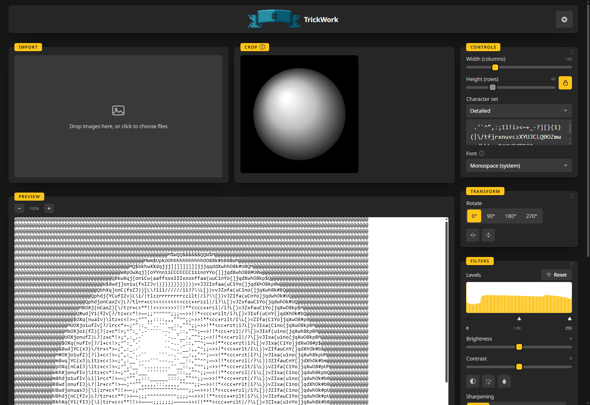

# TrickWork

A free, open-source ASCII art generator. TrickWork turns an image into
proportional-font-aware ASCII art, with a live preview and export to TXT, XHTML,
RTF and PNG. It runs as a desktop app for Windows, macOS and Linux, or as a
self-hosted Docker container.

## What makes it different

Characters are picked by how much visual ink they cover **at the font you
chose**, not by brightness alone, so proportional fonts render correctly instead
of looking stretched or squashed. Most image-to-ASCII tools (`chafa`,
`ascii-image-converter`, `jp2a`, `img2txt`) run on the command line, assume a
monospace font and show no preview. TrickWork is the feature set of the
abandoned [ASCGen2](https://sourceforge.net/projects/ascgen2/), rebuilt: a live
preview, proportional-width awareness and several export formats in one tool.

## Features

- **Live preview**: every slider, the character set and the font update the
  preview at once.
- **Image adjustments**: crop, rotate and flip, levels, brightness and contrast,
  invert, dithering, colour output and sharpening.
- **Batch queue**: drop several images at once; each converts and exports on its
  own, and one bad file never blocks the rest.
- **Four export formats**: plain TXT, a styled XHTML document, RTF in a fixed
  monospace font, and a rendered PNG, the one format that keeps a proportional
  font's look exactly.
- **Ten character sets**: nine of ASCII Gen 2's original ramps, verified against
  its source, a 70-character detailed ramp, or your own string.
- **Four fonts**, two monospace and two proportional, from the fonts already on
  your system.
- **26 languages**, a light and a dark theme, and appearance settings for
  corners, colours, motion and button labels.
- **Stateless**: no database, no accounts, nothing to configure beyond the port.

## Get it

- [Download for Windows (installer)](https://github.com/junkerderprovinz/trickwork/releases/latest/download/trickwork-windows-amd64-installer.exe)
- [Download for Windows (portable)](https://github.com/junkerderprovinz/trickwork/releases/latest/download/trickwork-windows-amd64-portable.exe)
- [Download for macOS](https://github.com/junkerderprovinz/trickwork/releases/latest/download/trickwork-macos-universal.dmg)
- [Download for Linux](https://github.com/junkerderprovinz/trickwork/releases/latest/download/trickwork-linux-amd64)
- [Run it with Docker or on Unraid](installing.md)

Every download is the latest release;
[the release notes](https://github.com/junkerderprovinz/trickwork/releases/latest)
list what changed.

## Where the name comes from

"Tricking" is the heraldic practice of sketching a coat of arms in outline and
marking its colours with letter abbreviations instead of paint, which is close
to what this tool does to a picture.
